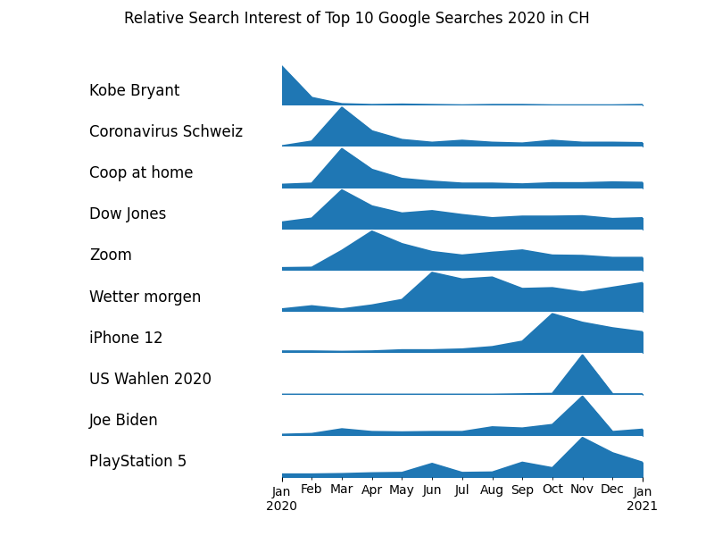

# Google Trend Analysis
This script shows the most popular search terms for specific languages, regions and years. They are arranged chronologically based on the month of highest relative popularity. Here, an example: 

## Options
<table>
    <tr>
        <td>--year</td>
        <td>Year to display top trends. </td>
    </tr>
    <tr>
        <td>--language</td>
        <td>Language of the search terms. For example 'en' or 'de'. </td>
    </tr>
    <tr>
        <td>--region</td>
        <td>Country and state/province. For example 'US-AL' for Alabama. The state/province are not mandatory. </td>
    </tr>
</table>

## Dependencies
* __pytrends__ is used to get the information
* __matplotlib__ is used to generate the plot